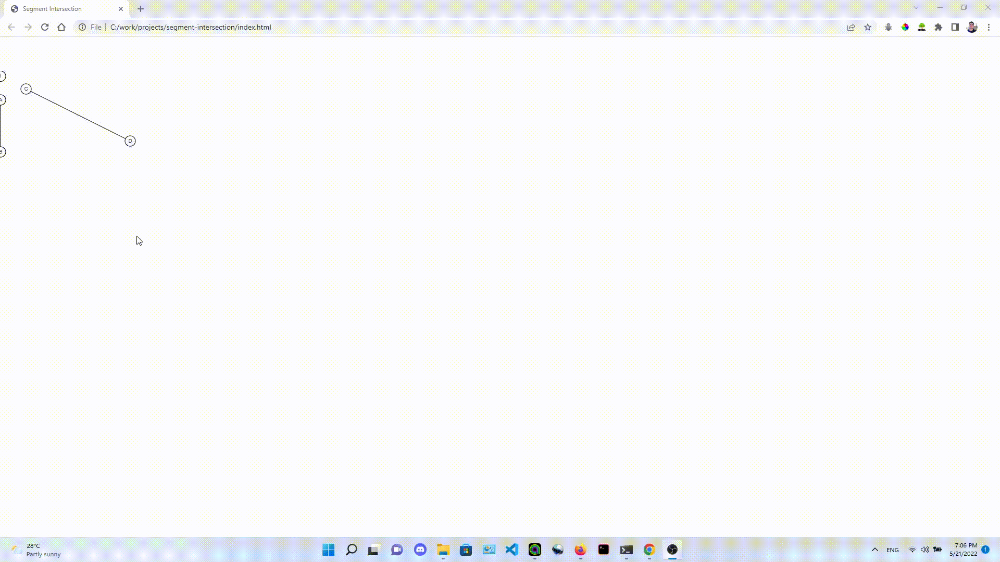

# SegmentIntersectionVisualizer
### given two segments in a canvas, we need to obtain the point where they intersect. 

## 1st milestone 
1. draw the two segments ( A-B & C-D) on the canvas
2. Figure out where they intersect using linear interpolation 
3. change the positions of A-B segment so that it keeps following the mouse. 
### problems 
* the program finds the intersection of the lines the segments belong to and not the lines themselves.
* if the two segments are parallel then there is no intersection which can cause the program to break. 

